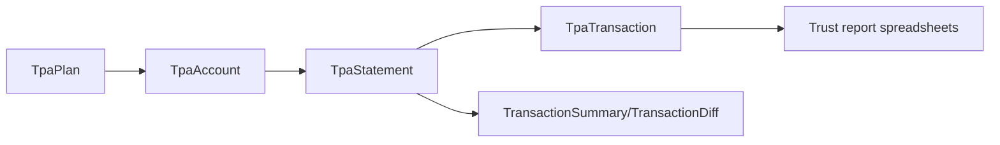

## Overview

The Trust Accounting API exposes a data model centered on **plans**, **brokerage accounts**,
**uploaded documents**, and the **statements and transactions** parsed from those documents.

This page introduces the core entities used in the OpenAPI specification and how they relate to the
end goal of producing trust report spreadsheets.

## Key entities

### Document

Represents an uploaded file (often a scanned brokerage statement).

- **Example fields** (see the `Document` schema in the API Reference): `_id`, metadata about the upload,
  and links to TPA statements.
- **Typical operations**:
  - Upload new documents via `POST /document/upload`.
  - Retrieve document details and presigned URLs via `GET /document/get`.

### TpaPlan

Represents a plan configured in the TPA system (for example, a specific retirement or trust plan).

- **Example fields** (from the `TpaPlan` schema): `_id`, `planName`, `planType`, `internalPlanId`,
  `pensionProId`, `endMm`, `endDd`, `active`, `directory`, `notes`, `lastModified`, and `status`.
- **Typical operations**:
  - Create plans with `POST /tpa/plan/create`.
  - Fetch or list plans with `GET /tpa/plan/get` and `GET /tpa/plan/list`.

### TpaAccount

Represents an individual brokerage account associated with a plan.

- **Example fields** (from the `TpaAccount` schema): `_id`, `planId`, `accountType`, `pensionProId`,
  `internalPlanId`, `provider`, `number`, `payee`, `active`, `notes`, `lastModified`, `type`, `status`.
- **Usage**:
  - Create accounts with `POST /tpa/account/create`.
  - Fetch or list accounts with `GET /tpa/account/get` and `GET /tpa/account/list`.
  - Combined with statements and transactions, these accounts form the basis of your trust reports.

### TpaStatement

Represents a parsed brokerage statement attached to a plan and account.

- **Example fields** (from the `TpaStatement` schema): `_id`, `plan`, `account`, `planId`, `accountNumber`,
  `document`, `pageCount`, `planYear`, `periodStart`, `periodEnd`, `months`, `beginningBalance`,
  `endingBalance`, `reconciles`, `tx`, `diff`, `errors`, `confidence`.
- **Usage**:
  - Attach statements to documents with `POST /tpa/statement/attach`.
  - List statements with `GET /tpa/statement/list`.
  - Confirm (lock) a statement with `POST /tpa/statement/confirm` when you are ready to rely on the results.
- **Reporting**:
  - Fields such as `beginningBalance`, `endingBalance`, and `tx` (`TransactionSummary`) are key inputs
    into your trust report spreadsheets.

### TpaTransaction

Represents a single parsed line item from a brokerage statement.

- **Example fields** (from the `TpaTransaction` schema): `_id`, `plan`, `account`, `planId`,
  `accountNumber`, `statement`, `row`, `planYear`, `page`, `date`, `description`, `amount`,
  `txType`, `txSubType`, `confidence`, `history`.
- **Usage**:
  - Retrieve transactions for a statement with `GET /tpa/transaction/list`.
  - Create or adjust transactions with `POST /tpa/transaction/create` (for example, to fix parsing errors
    or add missing activity).

### TransactionSummary and TransactionDiff

Attached to `TpaStatement` as `tx` and `diff`:

- **TransactionSummary** summarizes totals like `deposits`, `withdrawals`, `income`, `fees`, `transfers`,
  `purchases`, and more.
- **TransactionDiff** (see the API Reference) highlights differences between expected and parsed activity.

These derived objects make it easier to build trust report spreadsheets and reconciliation views without
recomputing aggregates yourself.

## Relationships

At a high level, the relationships between entities can be visualized like this:

- A **TpaPlan** can have multiple **TpaAccount** records.
- Each **TpaAccount** can have many **TpaStatement** records over time.
- Each **TpaStatement** has many **TpaTransaction** records.
- Summaries and diffs on the statement, plus the detailed transactions, feed into your trust reports.

## Identifiers and references

Common identifiers you will work with:

- `planId` – identifies a `TpaPlan`.
- `accountId` or `accountNumber` – identify `TpaAccount` records.
- `statementId` – identifies a `TpaStatement`.
- Transaction identifiers and row references – identify `TpaTransaction` records and their source rows.

We recommend you:

- Store these IDs in your own database for linking and troubleshooting.
- Use `externalReference` fields to tie Trust Accounting data to external systems.

## How this maps to the API

Across the Trust Accounting API:

- **Document endpoints** work with uploaded files and link to TPA statements.
- **TPA plan and account endpoints** manage `TpaPlan` and `TpaAccount` records and their IDs.
- **TPA statement endpoints** (`/tpa/statement/*`) manage `TpaStatement` objects and their summaries.
- **TPA transaction endpoints** (`/tpa/transaction/*`) expose `TpaTransaction` data for each statement.

For the exact field names, types, and allowed values, refer to the schemas shown in the
**API Reference → Trust Accounting API** tab.

