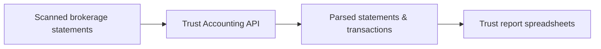

## What is the Trust Accounting API?

The **Stax Trust Accounting (TPA) API** takes in **scanned brokerage statements**, parses them into
structured data, and produces everything you need to generate a **trust report spreadsheet**.

Instead of manually keying in statement data or reconciling accounts by hand, you:

- Upload brokerage statements as documents.
- Attach each document to the correct **plan** and **brokerage account**.
- Let Stax parse the statement into **transactions**, balances, and summaries.
- Use the resulting data to generate trust reports and spreadsheets for your plans.

> The API is designed for **external developers** who want to automate trust reporting based on
> brokerage statements.

## Core concepts

At a high level, the Trust Accounting domain is built around:

- **TPA plans (`TpaPlan`)**: Retirement or trust plans you administer (for example, a specific 401(k) plan).
- **TPA accounts (`TpaAccount`)**: Individual brokerage accounts within a plan, usually identified by
  provider and account number.
- **Documents**: Uploaded brokerage statement files (often PDFs) that you send to the API.
- **TPA statements (`TpaStatement`)**: Parsed representations of a single brokerage statement, including
  beginning/ending balances, the covered period, and transaction summaries.
- **TPA transactions (`TpaTransaction`)**: Line items parsed from the statement (for example, deposits,
  withdrawals, income, fees, transfers, purchases).

You can see the full schemas for these objects in the **API Reference → Trust Accounting API** tab
(`TpaPlan`, `TpaAccount`, `TpaStatement`, `TpaTransaction`, `TransactionSummary`, and related types).

## How the API fits into your architecture

The Trust Accounting API is a **JSON over HTTPS** API layered on top of your existing systems:



- Your backend or ingestion pipeline uploads scanned brokerage statements using the **Document** endpoints.
- Once parsed, you use the **TPA** endpoints to attach statements to plans/accounts and work with the
  extracted transactions.
- From there, you can build or download **trust report spreadsheets** based on the parsed data.

For a full list of endpoints and schemas, see the **API Reference → Trust Accounting API** tab in the
navigation.

## Authentication at a glance

All Trust Accounting API requests must include:

- `Authorization: Bearer {apiKey}`
- `email: user@example.com`

This combination authenticates the request and ties it to a specific user identity for auditing.
For example:

```http
POST /trust/example HTTP/1.1
Host: api.stax.ai
Authorization: Bearer sk_live_xxx
email: user@example.com
Content-Type: application/json
```

You can find more details, including best practices for key management and environment setup, in
the **Authentication** page under Trust Accounting.

## What you can build

Here are some common product patterns you can implement with the Trust Accounting API:

- **Ingestion pipelines** that automatically upload brokerage statements from custodians or file drops.
- **Review tools** for operations teams to review parsed statements, fix issues, and confirm results.
- **Automated trust reports** that generate spreadsheets per plan, account, or period using parsed data.
- **Audit workflows** that surface discrepancies and confidence scores for further investigation.

## Next steps

To get the most out of the Trust Accounting API, continue with:

- **Authentication** – How to authenticate requests and manage API keys.
- **API endpoints** – A tour of the key operations and workflows.
- **Data model** – The entities, relationships, and IDs you will work with.
- **Limits & performance** – Guidance on rate limits, retries, and performance expectations.

